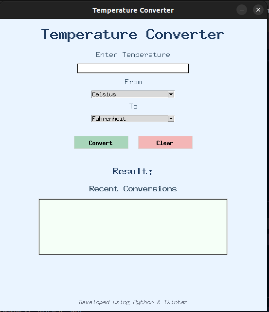
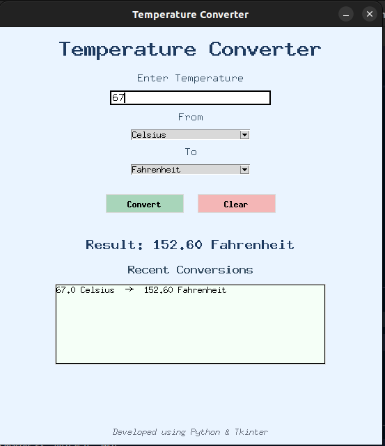
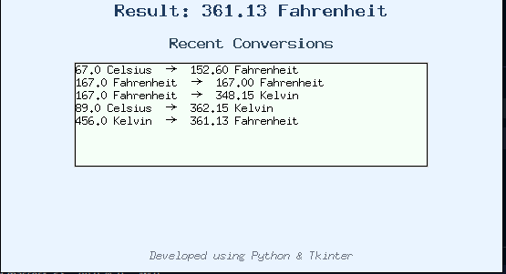

# 🌡️ Temperature Converter

A professional GUI-based **Temperature Converter** developed using **Python** and **Tkinter** as part of my Software Development Internship.

This application enables users to convert temperatures between **Celsius (°C)**, **Fahrenheit (°F)**, and **Kelvin (K)** through a simple and user-friendly graphical interface.

---

## 📌 Features

* Convert temperatures between:

  * Celsius (°C)
  * Fahrenheit (°F)
  * Kelvin (K)

* Professional Graphical User Interface (GUI)

* Input Validation

* Error Handling using Popup Messages

* Conversion History (Last 5 Conversions)

* Clear Button to Reset Data

* Professional Ink Blue Theme

* Clean and Well-Structured Code

---

## 🛠️ Technologies Used

* Python 3
* Tkinter

---

## 📂 Project Structure

```text
Temperature-Converter/
│
├── temperature_converter.py
├── README.md
├── LICENSE
├── .gitignore
│
└── screenshots/
    ├── home_screen.png
    ├── conversion_example.png
    └── history_feature.png
```

---

## 📸 Screenshots

### Home Screen



### Conversion Example




### Conversion History



## ⚙️ How It Works

1. Enter a temperature value.
2. Select the source temperature unit.
3. Select the target temperature unit.
4. Click the **Convert** button.
5. View the converted result instantly.
6. Recent conversions are stored and displayed in the history section.

---

## 🧮 Temperature Conversion Formulas

### Celsius

* Fahrenheit = (C × 9/5) + 32
* Kelvin = C + 273.15

### Fahrenheit

* Celsius = (F − 32) × 5/9
* Kelvin = (F − 32) × 5/9 + 273.15

### Kelvin

* Celsius = K − 273.15
* Fahrenheit = (K − 273.15) × 9/5 + 32

---

## 🚀 Installation & Usage

### Clone the Repository

```bash
git clone https://github.com/LakshmiPavaniKoyi/Temperature-Converter.git
```

### Navigate to Project Folder

```bash
cd Temperature-Converter
```

### Run the Application

```bash
python temperature_converter.py
```

---

## 🎯 Learning Outcomes

This project helped me improve my understanding of:

* Python Programming
* GUI Development using Tkinter
* Functions and Modular Programming
* Conditional Statements
* Exception Handling
* Lists and Data Management
* Event-Driven Programming
* Software Development Fundamentals

---

## 🔮 Future Enhancements

* Dark Mode Theme
* Copy Result Feature
* Export Conversion History
* Additional Unit Converters
* Enhanced UI Design

---

## 👩‍💻 Author

**Pavani Koyi**

Software Development Intern

---

## 📜 License

This project is licensed under the MIT License.

---

### ⭐ If you found this project useful, consider giving it a star on GitHub!
